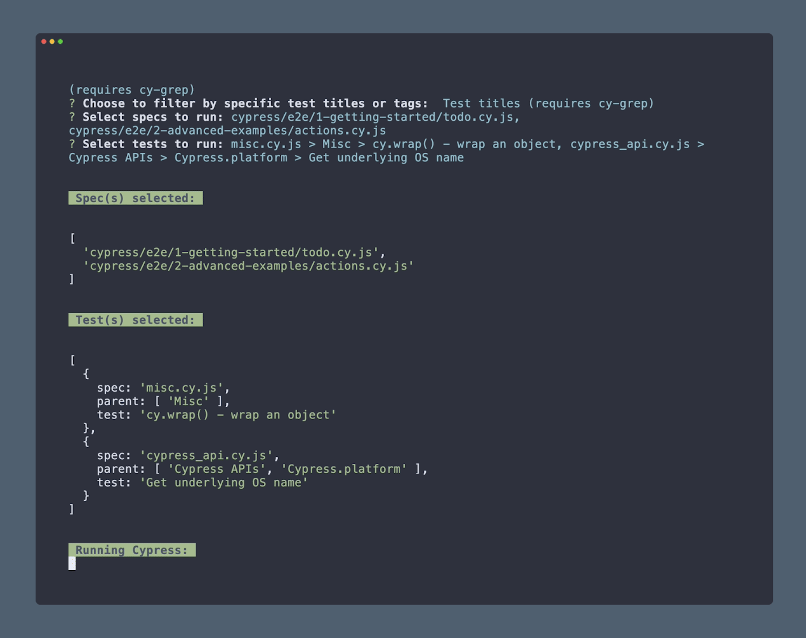

<h2 align=center>Cypress cli-select</h2>
<p align="center">
</p>

<p align="center">
Cypress interactive cli prompts to select and run spec(s) and test(s)/tag(s).
</p>


## Features

- ⌨ New interactive CLI prompts to select and run spec(s) and/or test(s)/tag(s)
- 👟 A new `cypress run` command to allow user to pass desired arguments

#### Table of Contents

- [Installation](#-installation)
- [Run mode](#-run-mode)
  - [Keyboard controls](#keyboard-controls)
- [Test titles or tags](#test-titles-or-tags)
- [Help mode](#-help-mode)
- [Choose spec pattern](#-choose-spec-pattern)
  - [Keyboard controls](#keyboard-controls)
- [Print selected](#-print-selected)
- [Test diff output](#test-diff-output)
- [Using a custom cypress config](#using-a-custom-cypress-config)
- [Setting up a `npm` script](#-setting-up-a-npm-script)
- [Typescript support](#-typescript-support)
- [Contributions](#-contributions)

---

## Installation

1. Install the following package:

```sh
npm install --save-dev cypress-cli-select
```

In order to run specific test(s) by their title, install the following plugin:

```sh
npm install --save-dev @bahmutov/cy-grep
```

Follow the installation and setup for `@bahmutov/cy-grep` in the project [README](https://github.com/bahmutov/cy-grep)

---

## Run mode

If you want to select e2e spec(s) to run, simply run the following command:

```bash
npx cypress-cli-select run
```

For selecting component spec(s):

```bash
npx cypress-cli-select run --component
```

If you have [@bahmutov/cy-grep](https://github.com/bahmutov/cy-grep) plugin installed in your project, you can also select tests to run by their title.

You can also include more cli arguments similar to `cypress run`, as the command harnesses the power of [Cypress module API](https://docs.cypress.io/guides/guides/module-api):

```bash
# Example
npx cypress-cli-select run --component --browser=chrome
```

### Keyboard controls

|              Keys              |             Action              |
| :----------------------------: | :-----------------------------: |
|         <kbd>Up</kbd>          | Move to selection above current |
|        <kbd>Down</kbd>         | Move to selection below current |
|         <kbd>Tab</kbd>         |         Select current          |
| <kbd>Ctrl</kbd> + <kbd>a</kbd> |           Select all            |
|      <kbd>Backspace</kbd>      |        Remove selection         |
|        <kbd>Enter</kbd>        |             Proceed             |
| <kbd>Ctrl</kbd> + <kbd>c</kbd> |              Exit               |

**Note**: You can also filter choices displayed in list by typing

---

## Test titles or tags

If `@bahmutov/cy-grep` package is installed in your project, test titles and tags are available to select.


---

## Help mode

To open the cli help menu, pass the `--help` flag:

```bash
npx cypress-cli-select run --help
```


---

## Choose spec pattern

If you are interested in running selected specs in a specific order, pass the following flag:

```bash
npx cypress-cli-select run --choose-spec-pattern
```

### Keyboard controls

|               Keys               |             Action              |
| :------------------------------: | :-----------------------------: |
|          <kbd>Up</kbd>           | Move to selection above current |
|         <kbd>Down</kbd>          | Move to selection below current |
| <kbd>Shift</kbd> + <kbd>⬆</kbd> |       Reorder current up        |
| <kbd>Shift</kbd> + <kbd>⬇</kbd> |      Reorder current down       |
|         <kbd>Enter</kbd>         |          Confirm order          |


---

## Print selected

If you want to print all selected spec(s) and/or test(s)/tag(s) just prior to Cypress run, pass the following flag:

```bash
npx cypress-cli-select run --print-selected
```



## Test diff output

At the end of the Cypress run, if the total tests in a spec file is not equal to the number of tests run from that spec file, you will see an output similar to the following:


**Note**: Apart from indicating a grep test filtering was performed on a given spec during the Cypress run, this output is particularly helpful in detecting `.only()`.

---

## Using a custom cypress config

If you want to use a custom Cypress config, pass it via `--config-file` flag:

```bash
npx cypress-cli-select run --config-file tests/cypress.config.js
```

---

## Setting up a `npm` script

For convenience, you may desire to house the `npx` command within an npm script in your project's `package.json`, including any desired cli arguments:

```json
  "scripts": {
    "cy:select": "npx cypress-cli-select run --browser=firefox"
  }
```

---

## Typescript support

For more information on Typescript support involved with `@bahmutov/cy-grep` package, refer to it's [README](https://github.com/bahmutov/cy-grep?tab=readme-ov-file#typescript-support).

---

## Contributions

Feel free to open a pull request or drop any feature request or bug in the [issues](https://github.com/dennisbergevin/cypress-cli-select/issues).

Please see more details in the [contributing doc](./CONTRIBUTING.md).
